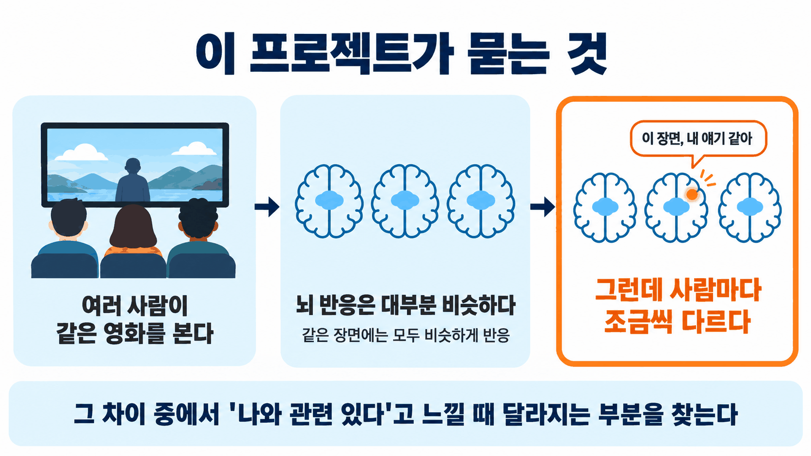
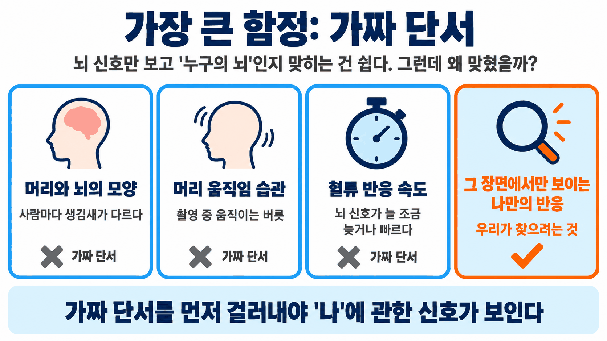
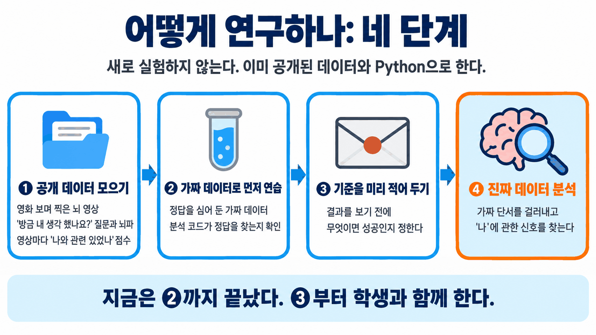

# selfref-brainfm

뇌 파운데이션 모델(SwiFT·DIVER)과 자연주의(naturalistic) 뇌 데이터로 자기참조(self-referential) 처리를 연구하는 학부생 연구 프로젝트 저장소의 공개본이다(미발표 자료와 내부 기록은 뺐다).

- 새로 합류했다면: `docs/ONBOARDING.md`(학부 연구생용 온보딩 가이드)부터 읽는다.
- 연구 설계와 실행 계획: `docs/PLAN.md`.

## 한눈에 보기

**1. 무엇을 묻나.** 같은 영화를 봐도 뇌 반응은 사람마다 조금씩 다르다. 그 차이 가운데 "나와 관련 있다"고 느낄 때 달라지는 부분을 찾는다.

**2. 가장 큰 함정.** 뇌 신호로 사람을 알아맞히는 것은 쉽지만, 그 단서의 상당 부분은 머리 모양이나 움직임 습관처럼 '나'와 무관하다. 이런 가짜 단서를 먼저 걸러낸다.

**3. 어떻게 하나.** 새로 실험하지 않고, 이미 공개된 데이터와 Python으로 한다. 분석 코드를 가짜 데이터로 먼저 시험하고, 결과를 보기 전에 성공 기준을 적어 둔다.

## 코드

- 환경: `uv sync`(Python 3.11 이상, numpy·scipy·pandas·scikit-learn)
- 테스트: `uv run pytest -m "not slow"`(합성 데이터 정답 회복·음성 대조, PLAN §10 게이트)
- 구성: `src/selfref/sim/`(과제별 합성 데이터), `analysis/`(추정기), `stats/`(§6 판정, ICC, 부트스트랩, Freedman–Lane)
