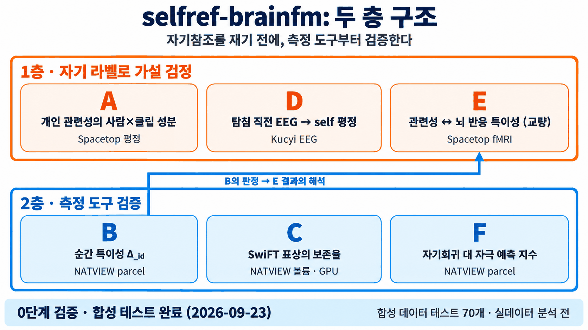
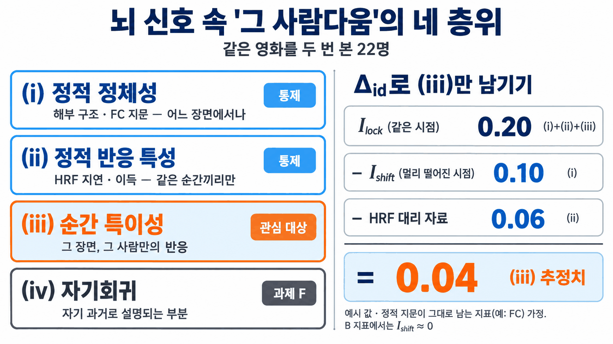
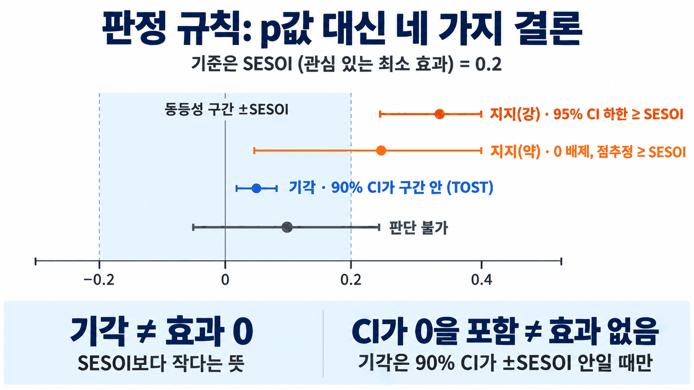

# selfref-brainfm

뇌 파운데이션 모델(SwiFT·DIVER)과 자연주의(naturalistic) 뇌 데이터로 자기참조(self-referential) 처리를 연구하는 학부생 연구 프로젝트 저장소의 공개본이다(미발표 자료와 내부 기록은 뺐다).

- 새로 합류했다면: `docs/ONBOARDING.md`(학부 연구생용 온보딩 가이드)부터 읽는다.
- 연구 설계와 실행 계획: `docs/PLAN.md`.

## 한눈에 보기

**두 층 구조.** 1층(A, D, E)은 자기 관련 라벨로 가설을 시험하고, 2층(B, C, F)은 그 전에 측정 도구를 검증한다.

**개인 고유 신호의 네 층위.** 특정 순간의 자기 관련 처리와 연결될 수 있는 층위는 순간 특이성(iii)이다. Δ_id와 HRF 대리 자료로 나머지를 뺀다(수치는 예시이며, B의 실제 지표에서는 I_shift ≈ 0이다. 온보딩 §5 B).

**판정 규칙.** 결과는 SESOI를 기준으로 지지(강·약), 기각, 판단 불가로 말한다. 기각은 효과가 0이라는 뜻이 아니다.

## 코드

- 환경: `uv sync`(Python 3.11 이상, numpy·scipy·pandas·scikit-learn)
- 테스트: `uv run pytest -m "not slow"`(합성 데이터 정답 회복·음성 대조, PLAN §10 게이트)
- 구성: `src/selfref/sim/`(과제별 합성 데이터), `analysis/`(추정기), `stats/`(§6 판정, ICC, 부트스트랩, Freedman–Lane)
