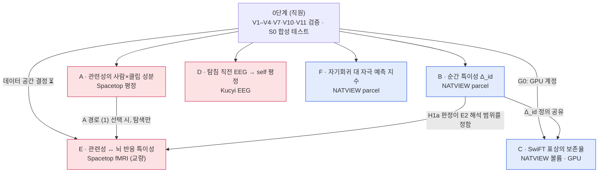

# selfref-brainfm 온보딩 가이드 (학부 연구생용)

- 기준일: 2026-09-23. 이후에 바뀐 내용은 `git log`와 `docs/PLAN.md` §4.1을 확인한다.
- 대상: 이 프로젝트에 새로 합류하는 학부 연구생. Python(pandas, numpy), 회귀와 상관을 수업에서 배운 정도를 가정한다. fMRI 분석, 동등성 검정, 파운데이션 모델은 몰라도 된다.
- 읽는 법: §0–§4와 §7–§13은 모두 읽는다(약 1시간). §5 과제 카드는 **맡은 과제만** 정독하고 나머지는 제목만 본다. 실습(§9)까지 약 2시간이 걸린다.
- 근거의 우선순위: 이 문서는 요약본이다. 내용이 어긋나면 `docs/PLAN.md` §4.1(0단계 결과) → `docs/stage0/`의 항목별 보고서 → PLAN 본문 순서로 따른다. PLAN 본문의 일부 수치는 0단계에서 틀린 것으로 확인되었고, §4.1이 그것을 덮어쓴다.
- 표기: ✅ 확인됨 · ⚠️ 조건부이거나 문제가 발견됨 · ❓ 모름 · ⏳ 연구책임자(PI) 결정 대기.
- 그림 요약: 사전 지식 없이 볼 수 있는 그림 3장(무엇을 묻나, 가짜 단서, 네 단계)이 `README.md`에 있다. 처음이라면 그림부터 본다.

---

## 0. 5분 요약

**무엇을 연구하나.** 사람이 자기 자신과 관련된 정보를 처리하는 방식(자기참조, self-reference)이 뇌 신호에 어떻게 드러나는지 본다. 도구는 두 가지다. 하나는 영화를 보거나 생각을 보고하는 동안 기록한 공개 뇌 데이터(fMRI, EEG)이고, 다른 하나는 대량의 뇌 데이터로 미리 학습한 뇌 파운데이션 모델(SwiFT)이다.

**왜 두 층으로 나누나.** "뇌 신호에 그 사람만의 특징이 있다"는 결과는 흔하다. 그러나 그 특징의 상당 부분은 두개골 모양, 머리 움직임 습관, 혈류 반응 속도처럼 자기참조와 무관한 것일 수 있다. 그래서 과제를 두 층으로 나눈다.

- **1층(A, D, E)**: 자기 관련 라벨(예: "방금 한 생각이 나에 관한 것이었나?" 평정)이 있는 데이터로 자기참조 가설을 직접 시험한다.
- **2층(B, C, F)**: 자기참조를 직접 재지 않는다. 대신 측정 도구가 정말 원하는 것을 재는지 먼저 확인한다.
  - B는 순간 특이성 지표를 검증한다. B의 판정은 E의 결과를 어디까지 "순간 특이성"으로 읽을 수 있는지 정한다.
  - C는 SwiFT 표상이 그 특이성을 보존하는지 본다. E에서 SwiFT 특징을 쓸지 판단하는 근거가 된다.
  - F는 자기회귀 지수가 개인 특성처럼 안정적인지 본다. 자기참조의 세 번째 뜻(§1.1의 c)을 위한 측정 검증이며, 지금은 1층 과제와 직접 연결되지 않는다.

**지금 어디까지 왔나(2026-09-23).** 직원이 0단계의 검증과 S0를 마쳤다(학생 GPU 계정 G0와 V8은 아직이다). 두 가지를 했다.
- 데이터가 계획한 분석을 지탱하는지 검증했다(V1–V4, V7, V10, V11).
- 모든 분석 코드를 합성 데이터로 시험하는 생성기와 테스트를 만들었다(S0, 테스트 70개).

실데이터 분석은 아직 하나도 하지 않았다. 학생 배정과 몇 가지 설계 선택은 PI 결정을 기다리고 있다(§8.2).

**첫 주에 할 일.** 이 문서를 읽고, 환경을 설치해 테스트를 돌리고(§9), 맡은 과제의 사전등록 초안을 멘토와 쓴다. 사전등록을 커밋하기 전에는 실데이터의 값을 열어 보지 않는다(§10).

### 0.1 문서에 나오는 코드

| 코드 | 뜻 | 예 |
|---|---|---|
| A–F | 학생 과제 6개(§5) | B = 순간 특이성 |
| V번호 | 0단계의 데이터·자원 검증 항목(Verification) | V1 = Kucyi 문항 확인. V8(Spacetop 직접 전처리 시간 측정)은 전처리본을 찾아(V10) 필요성이 줄었고 아직 하지 않았다. V5, V6, V9, V12는 우선순위가 낮고, V13은 필요 없어졌다 |
| S0 | 합성 데이터 생성기와 모의실험 준비(Simulation) | `src/selfref/sim/` |
| G0 | 과제 C 학생의 GPU 접근 준비 | 학생이 정해진 뒤 진행 |
| T0, T1, T1b, T2 | 데이터 다운로드 단계(Tier) | T0 = 메타데이터와 평정, T1 = 즉시 분석용 파일(parcel 시계열, EEG, 체크포인트), T1b = C용 볼륨, T2 = E용 Spacetop BOLD |
| §번호 | 이 문서의 절. "PLAN §번호"는 `docs/PLAN.md`의 절 | PLAN §4.1 = 0단계 결과 |

---

## 1. 큰 그림

### 1.1 "자기참조 능력"의 세 가지 뜻

같은 말이 세 가지로 읽힌다. 이 프로젝트는 각 뜻을 서로 다른 과제로 다룬다.

| 읽기 | 뜻 | 이 프로젝트의 측정 | 과제 |
|---|---|---|---|
| (a) 자기 관련 내용 처리 | "이건 나와 관련 있다"고 느끼는 내용을 처리하는 것 | Spacetop의 개인 관련성 평정(클립 단위), Kucyi의 `self` 문항(탐침 단위) | A, D, E |
| (b) 자기 상태 모니터링 | 내가 지금 졸린지, 딴생각 중인지 아는 것 | Kucyi의 각성 문항 `arou`와 EEG 지표의 일치 | D의 대안(현재는 쓰지 않음) |
| (c) 자기 궤적을 이어가는 역학 | 뇌 활동이 바깥 자극보다 자기 과거에 이끌리는 정도 | 자기회귀 대 자극 예측 지수 | F |

주의할 점이 하나 있다. **Spacetop의 개인 관련성 평정은 자기참조 그 자체가 아니다.** 클립이 끝난 뒤 5초 안에 "이 영상이 나와 얼마나 관련 있었나"를 0–100으로 답한 사후 평가다. 자기참조 처리의 대리 지표일 뿐이고, 몰입 정도(`rating_engaged`)와 섞여 있을 수 있다.

### 1.2 개인 고유 신호의 네 층위

뇌 신호로 "이건 철수의 뇌다"라고 알아볼 수 있게 하는 단서는 네 종류다. 이 구분이 프로젝트 전체의 뼈대다.

| 층위 | 뜻 | 비유(같은 영화를 두 번 본 22명) | 자기참조와의 관계 |
|---|---|---|---|
| (i) 정적 정체성 | 해부 구조, 세션별 촬영 조건(머리 위치 등), 평소의 뇌 영역 간 연결 패턴(정적 FC 지문, §2.1) | 얼굴. 영화의 어느 장면에서 보든 철수는 철수로 보인다 | 통제 대상. FC 기반 식별과 run 평균을 빼지 않은 임베딩에서는 크지만, B의 활동 패턴 지표에는 거의 들어오지 않는다. C의 주 분석(run 평균을 뺀 임베딩)에서도 크게 줄 것으로 예상되지만, 임베딩은 비선형이라 실제로 확인해야 한다(§5 B) |
| (ii) 정적 반응 특성 | 혈류 반응의 지연(HRF 지연)과 크기(이득). B의 HRF 대리 자료에서는 parcel별 반응 크기와 신호 대 잡음비 차이도 이 층위로 묶어 처리한다 | 늘 반 박자 늦게 따라 웃는 습관. 같은 장면을 같은 방식으로 늦게 따라가므로, 두 번 본 영화에서 **같은 순간끼리** 비교할 때만 두 번의 반응을 닮아 보이게 만든다. 서로 다른 장면끼리는 닮음을 만들지 않는다 | 통제 대상 |
| (iii) 순간 특이성 | 같은 장면의 같은 순간에, (ii)로 설명되지 않는 그 사람만의 반응 | 다른 사람은 웃는 장면에서 철수만 굳는 것. 그 장면에서만 나타난다 | 특정 순간의 자기 관련 처리(읽기 a)와 연결될 수 있는 **유일한** 층위. 단, (iii)이 있다고 곧바로 자기참조인 것은 아니다 |
| (iv) 자기회귀 | 신호가 자기 자신의 과거로 설명되는 부분 | 방금 하던 생각을 계속 이어가는 것 | 자기 궤적 역학(읽기 c)의 후보. F에서 따로 다룬다 |

과제 B와 C의 핵심 문제는 (iii)을 (i)과 (ii)에서 떼어 내는 것이다(§5 B).

### 1.3 과제와 게이트의 관계

게이트는 "이 조건이 풀려야 과제를 시작하거나 확정적으로 해석할 수 있다"는 관문이다.



붉은 상자가 1층, 파란 상자가 2층이다. 그림이 보이지 않는 환경(에디터, PDF)이라면 이렇게 읽는다.
- 0단계가 끝나면 A, B, D, F는 시작할 수 있다.
- C는 GPU 계정(G0)이 준비되어야 한다.
- E는 A가 메타데이터 경로로 진행되고 데이터 공간이 결정되어야 착수한다. E2 결과를 어디까지 해석할 수 있는지는 B의 판정(H1a)에 달려 있다.

---

## 2. 개념 사전

§3 이후를 읽는 데 필요한 개념만 모았다. 각 항목은 "뜻 → 이 프로젝트에서"의 순서다. 처음에는 훑어보고, 본문에서 막힐 때 돌아오면 된다.

### 2.1 뇌 신호

- **fMRI, BOLD**: 혈액 속 산소 농도에 따른 자기 신호 변화(BOLD 신호)를 3차원 영상으로 반복 촬영한다. 신경 활동을 직접 재는 것이 아니다. 활동 뒤에 따라오는 혈류·혈액량·산소 소비의 변화를 잰다.
- **run, 세션**: run은 스캐너 안에서 끊지 않고 한 번 연속으로 촬영한 단위다(예: 영화 한 편 10분). 세션은 한 번 방문해서 찍은 run들의 묶음이다. "세션 간 반복"은 다른 날 다시 쟀다는 뜻이다.
- **TR**: 뇌 전체를 한 번 촬영하는 간격. NATVIEW는 2.1초, Spacetop은 0.46초다. 시계열의 "한 칸"이 1 TR이다.
- **창(window)**: 시계열을 일정 길이로 자른 구간. B와 C는 20 TR(NATVIEW에서 42초) 창을 쓴다.
- **HRF(혈류역학 반응 함수)**: 짧은 신경 활동 뒤 BOLD가 그리는 모양이다. 약 5초 뒤 정점에 이르고, 약 15초 무렵 기준선 아래로 가장 깊이 내려갔다가(undershoot) 약 25초 무렵 기준선으로 돌아온다.
  - 사람마다 지연(얼마나 늦게 오르나)과 이득(얼마나 크게 오르나)이 조금씩 다르다(§1.2의 층위 ii).
  - 이 프로젝트에서는 깜빡이는 체커보드를 보여 주는 과제(checker)로 사람별 HRF를 추정한다.
  - B가 서로 다른 시점을 비교할 때 창 사이를 창 길이 + 15초 이상 띄우는 것도 이 긴 꼬리의 대부분을 피하기 위해서다.
- **복셀, parcel, 아틀라스**: 복셀은 fMRI 영상의 작은 정육면체 하나다. parcel은 복셀 수백~수천 개를 뇌 영역 단위로 묶어 평균한 것이다. 뇌를 parcel로 나눈 지도가 아틀라스다. NATVIEW는 Schaefer 아틀라스로 뇌를 100·200·400개로 나눈 parcel 시계열을 제공한다(숫자가 클수록 parcel이 작다).
- **FC(기능적 연결성)와 FC 지문**: FC는 두 뇌 영역의 시계열 상관이다. 모든 영역 쌍의 상관 행렬은 사람마다 달라서, 지문처럼 사람을 알아보는 데 쓰인다. 이것이 §1.2의 "정적 FC 지문"이다.
- **DMN(디폴트 모드 네트워크)**: 쉬거나 자기 생각을 할 때 활발해지는 뇌 영역 묶음. 자기참조 연구에서 가장 먼저 보는 네트워크다. 다만 이야기 이해, 기억 회상, 타인의 마음 추론에도 관여한다. 그러므로 "DMN이 활발했다 → 자기참조를 했다"고 거꾸로 추론하면 안 된다.
- **FD(framewise displacement)**: TR마다 머리가 얼마나 움직였는지를 한 숫자로 요약한 값. 머리 움직임도 사람마다 고유해서 "개인 식별"을 부풀린다. 그래서 fMRI를 쓰는 과제(B, C, E, F)에서 공변량으로 넣는다.
- **tSNR**: 시계열의 신호 대 잡음비. 측정 품질의 지표다.
- **전처리, fMRIPrep, MNI, fsLR**: 전처리는 움직임 보정, 표준 뇌 모양에 맞추기처럼 분석 전에 하는 정리 작업이다. fMRIPrep은 그 표준 도구다. 표준 공간은 두 가지다. MNI는 3차원 볼륨 좌표이고, fsLR은 대뇌 피질 표면 좌표다. SwiFT는 볼륨 입력만 받으므로 MNI가 필요하다.
- **EEG, 대역 파워, 스펙트럼 기울기**: EEG는 두피 전극으로 뇌의 전기 활동을 밀리초 단위로 잰다.
  - 대역 파워는 알파(8–12 Hz) 같은 주파수 대역의 세기다.
  - 스펙트럼 기울기는 주파수가 올라갈수록 파워가 줄어드는 정도로, 특정 대역과 무관한 배경 활동을 나타낸다. F에서는 같은 개념을 fMRI 시계열에 적용한다.
  - D는 탐침 직전 10초 동안 31채널에서 로그 대역 파워와 기울기를 뽑아 특징으로 쓴다. 합성 데이터에서는 특징 186개로 모의한다.
- **동시 EEG-fMRI**: 두 신호를 한 스캐너 안에서 동시에 기록한 데이터. Kucyi와 NATVIEW가 여기에 해당한다.

### 2.2 실험 패러다임

- **자연주의(naturalistic) 자극**: 통제된 짧은 시행 대신 영화나 이야기처럼 실제에 가까운 자극을 쓰는 실험.
- **inscapes**: 줄거리 없이 추상 도형이 천천히 움직이는 영상. 휴식과 비슷하지만 눈을 뜨고 화면을 보는 조건이다.
- **peer**: 안구 위치 추정을 보정하는 짧은 과제(90초).
- **경험 표집(experience sampling)과 탐침(probe)**: 과제 도중 불시에 멈추고 "방금 무슨 생각을 했나"를 묻는 방식. 한 번 묻는 것이 탐침 하나다.
- **mind-blank**: 탐침에서 "아무 생각도 떠올릴 수 없었다"고 답한 경우. 이때 `self` 평정의 의미가 모호하다.
- **ISC(피험자 간 상관)**: 한 사람의 시계열과 나머지 사람들 평균 시계열의 상관. 높으면 그 영역이 모두에게 공통인 자극 구동 반응을 보인다는 뜻이다.
- **장면 경계**: 영화에서 사건이 바뀌는 지점. 경계 근처에서 뇌 반응이 달라지므로 B·C에서 공변량으로 넣는다.
- **시간 표류**: 과제가 진행될수록 졸림이나 피로 때문에 신호나 평정이 한 방향으로 서서히 바뀌는 것.

### 2.3 모델

- **파운데이션 모델(FM)**: 대량의 데이터로 미리 학습해 두고 여러 과제에 가져다 쓰는 큰 모델.
- **SwiFT v1**: 연구실이 만든 fMRI 파운데이션 모델. 4D fMRI(96×96×96 공간 × 20 TR 창)를 받아 벡터 하나로 요약한다. 이 벡터를 **임베딩(표상)**이라 부른다. 학습된 가중치를 저장한 파일을 **체크포인트**라 한다.
- **대조학습(contrastive learning)**: "같은 사람의 두 창은 가깝게, 다른 사람의 창은 멀게" 배우도록 학습하는 방식이다. SwiFT v1 공개 체크포인트가 이렇게 학습되었다(V4). 따라서 **SwiFT 임베딩으로 사람을 알아볼 수 있다는 것은 학습 목표에서 기대되는 결과이고, 순간 특이성이나 자기참조에 대해서는 아무것도 보여 주지 않는다.** C가 식별 정확도가 아니라 "보존율"을 재는 이유다.
- **사전학습 누수**: 모델이 학습한 데이터로 모델을 평가하면 성능이 부풀려진다. SwiFT v1은 대규모 공개 뇌영상 데이터(HCP, ABCD, UK Biobank)로 학습했다. 그래서 FM 분석에 HCP를 쓰지 않는다.
- **무작위 초기화 모델**: 구조는 같지만 학습하지 않은 모델. "사전학습 덕분인가, 구조 덕분인가"를 가르는 대조군이다.
- **PCA(주성분 분석)**: 많은 변수를 적은 수의 요약 변수로 줄이는 방법. C에서 "FM 없이 단순히 차원만 줄였을 때"의 기준선으로 쓴다.
- **ridge 회귀**: 계수 크기에 벌점을 주는 선형 회귀. 특징이 많을 때 과적합을 줄인다. A, B, D, F의 주 분석은 모두 선형 모형이다.

### 2.4 통계

- **사전등록(preregistration)**: 데이터를 보기 전에 가설, 분석 방법, 판정 기준을 글로 고정해 두는 것. 결과를 본 뒤 분석을 바꾸는 일(p-hacking)을 막는다. 이 프로젝트에서는 `docs/prereg/`에 커밋한다(아직 없는 폴더다. 첫 사전등록 때 만든다).
- **SESOI(관심 있는 최소 효과 크기)**: "이보다 작으면 이론적으로 의미 없다"고 미리 정한 효과 크기. 판정 규칙 전체가 이 값을 기준으로 돌아간다(§7). 이 문서와 PLAN에 적힌 SESOI는 모두 **제안값**이고, 1주차 사전등록에서 확정한다.
- **95% CI와 90% CI**: 신뢰구간. 규칙 2(§7)에서는 "지지"를 판정할 때 95% CI를, "기각"을 판정할 때 90% CI를 쓴다. 규칙 3은 둘 다 95% CI를 쓴다.
- **동등성 검정(TOST, Two One-Sided Tests)**: "효과가 SESOI보다 작다"를 보이는 검정이다.
  - "효과 > −SESOI"와 "효과 < +SESOI"를 각각 α = .05 단측으로 검정한다.
  - 두 검정을 모두 통과하는 것은 90% CI 전체가 −SESOI와 +SESOI 사이에 들어오는 것과 같다. 그래서 90% CI를 쓴다.
  - **효과가 0이라는 증명이 아니다.** 효과가 있더라도 SESOI보다 작다는 것을 α = .05 수준에서 보였다는 뜻이다.
- **Fisher z**: 상관계수 r을 atanh(r)로 바꾼 값. 상관계수는 ±1 근처에서 분포가 찌그러지므로, 평균을 내거나 빼기 전에 z로 바꾼다. B·C의 Δ_id가 이 단위다.
- **ICC(2,1)**: 급내상관. 같은 사람을 두 번 쟀을 때 값이 얼마나 일치하는지(재검사 신뢰도)를 나타낸다.
  - 대략 "전체 분산 가운데 사람 간 차이가 차지하는 비율"로 이해하면 된다. 1이면 두 번의 값이 완전히 같다.
  - 보통 0–1 사이지만 표본에서는 음수도 나온다(S0의 null에서 −0.15).
  - (2,1)은 종류 표시다. 두 세션을 "있을 수 있는 여러 세션 가운데 두 번"으로 보고, 세션 사이의 평균 차이도 불일치로 센다(절대 일치). 그래서 순위가 같아도 두 세션의 평균이 통째로 다르면 값이 낮아진다.
  - 표본의 사람들이 서로 비슷하면 측정이 좋아도 ICC가 낮게 나온다.
  - F는 세션 간 ICC가 0.4를 넘는지 본다.
- **사람 안 중심화**: 각 사람의 평정에서 그 사람의 평균을 뺀다. "무엇이든 높게 주는 사람" 같은 사람 간 차이를 없애고, 한 사람 안의 변동만 남긴다.
- **교차검증(CV), LOSO, 중첩 CV**
  - CV: 데이터를 나눠 한쪽으로 학습하고 다른 쪽으로 평가한다.
  - LOSO(leave-one-subject-out): 한 사람씩 빼 두고 평가한다.
  - 중첩 CV: 바깥 CV의 학습 데이터 안에서 한 번 더 CV를 돌려 ridge 벌점 강도 같은 설정을 고른다. 설정을 고를 때 평가용 사람을 보지 않게 하기 위해서다.
- **ΔR²**: 기존 변수만 쓴 축소 모형에 새 변수(D에서는 EEG)를 더했을 때 교차검증 R²가 얼마나 느는지.
- **치환 검정과 null 분포**: 라벨을 무작위로 섞어 "효과가 없을 때 나올 법한 값"의 분포를 만든다. 무엇을 섞느냐가 중요하다. 보존해야 할 구조(시간 표류, 자기상관)까지 섞어 버리면 null이 너무 쉬워져 가짜 유의가 나온다.
- **Freedman–Lane**: 교란 변수가 있을 때 쓰는 치환 방법이다.
  1. 교란 변수만 넣은 축소 모형으로 y를 예측한다.
  2. 예측하지 못한 나머지(잔차)를 사람 안에서 섞는다.
  3. "축소 모형의 예측값 + 섞인 잔차"로 가짜 y를 만든다.
  4. 가짜 y로 전체 모형과 축소 모형을 다시 비교해 null 값 하나를 얻는다. 이것을 1,000번 반복한다.

  교란 변수가 설명하는 부분은 보존하고, 관심 변수와의 연결만 끊는다. 단, 잔차를 서로 바꿔도 된다고 가정하므로 탐침 사이의 시간 의존성은 보존하지 못한다. D에서 쓴다.
- **군집 부트스트랩**: 사람 단위로 복원 추출해 CI를 만드는 방법. 한 사람의 여러 측정은 서로 독립이 아니기 때문에 사람을 단위로 뽑는다. B처럼 한 사람의 값에 다른 사람이 함께 들어가는 지표는 사람 단위로 뽑아도 의존이 남는다. 그래서 과제별 CI 방법은 사전등록에서 정한다.

### 2.5 코드 검증

- **합성 데이터와 정답 회복 테스트**: 효과를 일부러 심어 둔 가짜 데이터를 만들고, 분석 코드가 심은 효과를 찾아내는지 본다.
- **음성 대조**: 교란 요인(정적 지문, HRF 차이, 움직임 등)만 심고 효과는 심지 않은 데이터에서, 코드가 "효과 있음"이라고 **말하지 않는지** 본다. 가짜 발견을 막는 장치다.
- **3 seed 규칙**: 무작위성이 있는 절차는 난수 seed 3개 모두에서 기준을 넘어야 통과다.
- **결과 확률**: 계획한 표본 크기로 모의실험을 수백 번 돌려 두 확률을 구한다. 하나는 효과가 있을 때 "지지"가 나올 확률이고, 다른 하나는 효과가 0일 때 "기각"이 나올 확률이다(§7 규칙 4). 일반적인 검정력 분석을 이 프로젝트의 판정 범주에 맞춘 것이다.

---

## 3. 데이터셋

실데이터는 저장소에 없다. `data/` 폴더는 `.gitignore` 대상이라 clone하면 아예 존재하지 않는다. 무엇을 어디서 받았는지는 `docs/datasets.md`에 있다. 데이터셋 이름의 `ds` 번호는 공개 뇌영상 저장소 OpenNeuro의 데이터셋 번호다.

| | Kucyi (ds007216) | Spacetop (ds005256, 전처리본 ds007070) | NATVIEW |
|---|---|---|---|
| 쓰는 과제 | D | A, E | B, C, F |
| 신호 | 동시 EEG-fMRI. 분석에는 EEG만 쓴다(전처리 fMRI가 없음) | fMRI | 동시 EEG-fMRI. 분석에는 fMRI parcel과 볼륨을 쓴다 |
| 사람 수 | 24명 | 117명(alignvideo 자료가 있는 사람은 116명) | 22명 |
| 자극 | 휴식 중 간헐적인 경험 표집 탐침(ES run). 주의 과제(GradCPT) run은 따로 있으며 D에서는 쓰지 않는다 | 짧은 영상 클립 49개(alignvideo 과제) | 영화(Despicable Me, The Present 등), inscapes, 휴식, checker, peer |
| 자기 관련 라벨 | ✅ `self` 문항 "Were your thoughts about yourself?". 관측값 1–10(정의된 척도 범위는 ❓) | ✅ 클립마다 개인 관련성 0–100 | 없음(2층 과제용) |
| TR | 2 s | 0.46 s | 2.1 s |
| 근거 | PLAN §4.1 V1, `docs/stage0/V1.md` | PLAN §4.1 V2·V10, `docs/stage0/V2.md`, `V10_V11.md` | PLAN §4.1 V3, `docs/stage0/V3.md` |

**Kucyi의 구조.** 24명이 47세션에 참여했다. 세션마다 ES run이 3개이고(sub-003 ses-001만 일찍 끝나 2개), 모두 140 run이다. run마다 탐침이 6개이므로 탐침은 모두 840개다. 탐침마다 13개 문항에 답하므로 run당 평정은 78개(6 × 13)다. 이 가운데 `self` 평정이 있는 탐침은 838개다.

**Spacetop의 구조.** 모든 사람이 49개 클립을 **같은 순서로 한 번씩** 봤다. 관련성 평정의 51.7%가 무응답이다.

**NATVIEW의 구조.** 영화 6편이 **같은 세션 안에서** 두 번씩 반복된다. 1일차 영화 3편(dme, tp, monkey1)은 22명, 2일차 영화 3편(dmh, monkey2, monkey5)은 16–17명이다. 세션 간 반복은 inscapes·rest·checker(17명), peer(15명)이고, 영화는 sub-17의 tp 하나뿐이다.

알아 둘 함정 세 가지.

1. **Kucyi 척도.** PLAN 본문 §2.1의 "1–9"는 틀렸다. 실제 관측값은 1–10이다(V1).
2. **Spacetop에는 반복 제시가 없다.** 모든 사람이 같은 순서로 봤기 때문에 "클립 효과"와 "몇 번째로 봤는가(피로)"를 분리할 수 없다. S0에서 위치에 따른 표류를 심었더니, 추정한 클립 효과가 '클립 + 위치'의 합과 0.99로 상관했다. 클립 자체와의 상관은 0.82였다. 즉 추정한 클립 효과에 위치 효과가 섞여 들어간다.
3. **NATVIEW의 영화 반복은 모두 같은 세션 안이다.** 서사 영화를 다른 날 다시 본 사람은 1명뿐이다. 이것이 F의 설계를 흔든다(§5 F).

---

## 4. 모델

| 모델 | 상태 | 역할 |
|---|---|---|
| 선형 기준선(ridge, ISC, 분산 분해, 대역 파워) | 가중치 필요 없음 | A, B, D, F의 주 분석. 모든 FM 결과의 비교 기준 |
| SwiFT v1(대조학습) | ✅ 공개 체크포인트 확보(4.40M 파라미터, 입력 96³ × 20 TR) | C의 분석 대상, E의 특징 후보 |
| 그 밖의 FM(EEG 모델, SwiFT v2 등) | 일부만 있거나 없음(PLAN §7) | 학부생 과제의 전제가 아니다 |

학부생 과제의 기본은 **선형 모형**이다. FM은 선형 기준선보다 나은지를 비교하는 대상이지, 출발점이 아니다.

---

## 5. 과제 카드

맡은 과제의 카드만 정독한다. 각 카드의 "현재 상태"는 0단계 결과(PLAN §4.1)를 반영한 것이고, "함정"은 S0 모의실험에서 발견된 것이다(`docs/stage0/S0_findings.md`). 수치 기준은 모두 제안값이다. PLAN과 현재 코드가 다른 곳은 "코드 메모"로 적었다. 어느 쪽을 따를지는 사전등록에서 정한다.

### A. 개인 관련성에 사람×클립 성분이 있는가 (1층)

- **질문**: "이 클립이 나와 관련 있다"는 평정에는 두 가지 효과가 섞여 있다. 하나는 클립 자체의 효과(모두가 관련 있다고 느끼는 클립)이고, 다른 하나는 사람 자체의 효과(무엇이든 높게 주는 사람)다. 그 둘을 빼고도 "이 사람에게 이 클립이 특히 관련 있다"는 성분이 잡음이 아닌 것으로 남는가?
- **데이터**: Spacetop alignvideo 평정(events.tsv)과 참가자 정보. 뇌 데이터는 쓰지 않는다.
- **방법**
  - 먼저 분산을 사람, 클립, 나머지(사람×클립 + 잡음)로 나눈다. PLAN은 교차 무선효과 모형 `relevance ~ 1 + (1|subject) + (1|clip)`을 쓴다. 이 식은 사람마다, 클립마다 평균이 따로 있다고 보고 그 크기를 추정한다.
  - 그다음 **메타데이터 경로**로 나머지가 잡음만은 아닌지 본다. 클립 특징(내용 범주 등)과 사람 특징(나이, 성별 등)의 상호작용이 나머지를 교차검증으로 예측하는지 본다. 교차검증은 클립 단위로 나누므로, 처음 보는 클립에 대한 예측을 평가한다.
- **코드 메모**: `analysis/variance.py`는 혼합모형 대신 사람 + 클립 가산 모형을 교대 최소제곱으로 적합하고, 잔차를 클립 단위 교차검증 ridge로 예측한다.
- **현재 상태**: ⚠️ 반복 제시가 없다. 그래서 원래 계획의 "반복 경로"(같은 클립을 두 번 본 반응의 상관)는 쓸 수 없다. 메타데이터 경로는 **직원이 클립 49개의 특징을 코딩해야** 열린다. ⏳ PI가 둘 중 하나를 고른다.
  - (1) 코딩한 뒤 메타데이터 경로로 진행한다.
  - (2) A를 기술 통계 과제로 둔다.
- **판정의 비대칭**: 메타데이터 경로는 "지지"만 가능하고 "기각"은 불가능하다. 메타데이터로 예측하지 못해도, 메타데이터와 무관한 사람×클립 상호작용이 있을 수 있기 때문이다. 지지가 아니면 "판단 불가"다.
- **함정**: 클립 효과와 제시 위치(피로)가 교란된다(§3 함정 2). 사전등록에 적어야 한다.
- **SESOI(제안)**: 교차검증 R² = 0.02.
- **선행 지식과 계산**: pandas, 혼합모형의 개념. CPU로 분 단위.

### B. 순간 특이성이 있는가 (2층)

- **질문(가설 H1a)**: 같은 영화를 두 번 본 사람들에게서, 같은 순간에만 나타나는 그 사람만의 반응(§1.2의 iii)이 HRF 차이를 통제한 뒤에도 남는가? 판정 대상은 Δ̄_id − Δ̄_id^HRF다(아래). PLAN은 이 밖에 창마다 효과가 다른지(H1b)도 본다.
- **데이터**: NATVIEW의 같은 영화 run 두 개의 parcel 시계열, 그리고 checker run(HRF 추정용).

#### Δ_id 정의

창(20 TR = 42초)마다 run 1과 run 2의 활동 패턴을 비교한다. 창 하나의 (parcel × 시간) 값을 parcel마다 표준화한 뒤 한 줄로 펴고, 두 창끼리 상관을 구한다.

- s_ij(w, w′): 사람 i의 run 1 창 w와 사람 j의 run 2 창 w′의 상관(Fisher z).
- I(w, w′) = (자기 자신과의 유사도) − (타인과의 유사도 평균). 타인과의 유사도를 빼는 것은 모두에게 공통인 자극 반응을 없애기 위해서다. 남는 것은 "자기 자신이 타인보다 얼마나 더 닮았나"다.
- I_lock(w) = I(w, w): **같은 시점**끼리 비교한다. 지표가 담는 만큼의 (i) 정적 지문, (ii) 반응 특성, (iii) 순간 특이성이 모두 들어 있다.
- I_shift(w): **멀리 떨어진 시점**끼리 비교한 값의 평균이다. 창 길이 + 15초 이상, 즉 28 TR 이상 떨어져야 한다. 시점이 다르므로 시점과 무관한 자기 유사성, 즉 지표가 담는 만큼의 (i)만 남는다(B에서는 거의 없다, 아래 참조).
- Δ_id = I_lock − I_shift. 시점과 무관한 성분이 빠지고, 같은 시점에 고정된 개인 고유 성분 (ii) + (iii)이 남는다. 모든 창과 사람에 대해 평균한 값을 Δ̄_id(델타 바)로 적는다.

**B에서는 I_shift가 거의 0일 것으로 예상된다.** B의 지표는 창 안에서 parcel마다 표준화한 뒤, 같은 parcel의 시간 모양끼리 상관을 구한다.
- 평균 수준과 공간 패턴은 창 안 표준화로 지워진다.
- 정적 FC는 연결 구조가 같아도 그 구조가 만드는 시간 경과가 run마다 새로 실현된다. 그래서 두 run의 시간 모양끼리 비교하는 이 지표에는 기여하지 않는다.

S0 기본 설정에서 I_lock 0.0249, I_shift −0.0001이었다. 다만 S0 생성기에는 run 사이에 이어지는 시점 무관 성분이 애초에 없으므로, 실데이터에서 I_shift를 확인한다. I_shift는 그래도 남을 수 있는 시점 무관 자기 유사성을 빼는 안전장치다. run 평균을 빼지 않은 임베딩이나 FC처럼 정적 정체성이 그대로 들어가는 지표에서는 두 항 모두에 크게 들어가고, 시간 이동 항이 핵심이 된다. C가 run 평균 임베딩을 뺀 판본을 주 분석으로 쓰는 것도 이 때문이다. 다만 평균 차감으로 빠지는 것은 사람별 상수 부분이므로, 그 판본의 I_shift에 정체성이 얼마나 남는지는 실데이터에서 확인한다.

**숫자로 보는 예(가상의 값, 정적 지문이 그대로 남는 지표를 가정).** 계산 순서를 보여 주려는 예다. B의 실제 값은 위와 같이 I_shift ≈ 0이다.

| 비교 | 자기 자신과 | 타인과(평균) | 차이 = I |
|---|---|---|---|
| 같은 시점(lock) | 0.50 | 0.30 | I_lock = 0.20 |
| 먼 시점(shift) | 0.15 | 0.05 | I_shift = 0.10 |

- 타인과의 같은 시점 유사도 0.30은 모두에게 공통인 영화 반응이다. 빼서 없앤다.
- I_shift 0.10은 시점과 무관하게 "자기가 자기와 더 닮은" 정도, 즉 정적 지문(i)이다. B의 지표라면 이 값이 0에 가깝다.
- Δ_id = 0.20 − 0.10 = 0.10은 같은 시점에서만 생기는 개인 고유 성분, 즉 (ii) + (iii)이다.
- 아래의 HRF 대리 자료에서 Δ_id^HRF = 0.06이 나왔다면, (iii)의 추정치는 0.10 − 0.06 = 0.04다.

**가정의 한계.** Δ_id가 (ii) + (iii)만 남긴다는 해석은 "두 run에서 같은 시점에 반복되는 개인 고유 성분은 모두 자극 때문"이라는 가정에 기댄다. 그러나 두 run은 같은 세션에서 찍었고 run 시작 시각에 맞춰 정렬되어 있다. 그래서 자극과 무관하지만 run 경과에 묶인 그 사람만의 궤적 가운데, 시점마다 모양이 달라지는 부분(run 초반의 과도 반응, 중간에 꺾이는 각성 변화)은 I_lock에만 들어가 (iii)으로 집계된다. HRF 대리 자료도 이런 궤적을 만들지 않으므로 빼 주지 못한다. 반면 run 내내 한 방향으로 가는 단조 드리프트는 먼 시점끼리도 닮아 I_shift에도 들어가므로 대부분 상쇄된다. 장면에 맞춰 일어나는 움직임과 호흡은 I_lock에 남는다. 따라서 (iii)은 "시점에 고정된 개인차"이지 곧바로 자기참조가 아니다.

#### HRF 통제

(ii)를 빼기 위해 "HRF 대리 자료"를 만든다. 순서는 다음과 같다.
1. 집단 평균 신호를 집단 HRF로 역합성곱해 구동 신호를 얻는다. 역합성곱은 HRF가 신경 활동을 시간축으로 "번지게" 만든 과정을 거꾸로 되돌려, 번지기 전의 신호를 추정하는 것이다.
2. 이 구동 신호를 사람마다 checker로 추정한 HRF 지연으로 다시 합성곱한다.
3. parcel별 진폭은 그 사람의 영화 데이터에 맞추고 잡음을 더한다.

이 자료에서 시간 고정 반응(영화의 특정 시점에 묶여 매번 같은 때 나타나는 반응)은 집단 공통 신호뿐이다. 그러므로 (iii)은 없다. 대신 (ii)에 해당하는 것들이 들어간다. 사람별 HRF 지연 차이(checker에서), 그리고 영화 데이터에서 맞춘 parcel별 진폭과 잡음 수준(신호 대 잡음비) 차이다. 여기서 계산한 Δ_id^HRF를 (ii)의 몫으로 본다. **주 추정 대상은 Δ̄_id − Δ̄_id^HRF**이고, 이것을 (iii)의 추정치로 쓴다.

단, 대리 자료가 잡지 못하는 교란은 이 값에 그대로 남는다.
- 영역별 HRF 차이(함정 2)
- 장면에 맞춰 일어나는 머리 움직임, 호흡, 눈 움직임

그래서 FD 같은 공변량과 "움직임 특징만으로 계산한 Δ_id" 대조를 함께 둔다.

#### 현재 상태, 함정, 기준

- **현재 상태**: ✅ V3 통과(22명, 같은 영화 2 run). S0 테스트 통과.
- **함정 1(계획과 다른 진폭)**: PLAN은 대리 자료에 checker로 추정한 이득을 쓴다고 적었다. 현재 코드는 진폭을 영화 데이터에서 parcel별로 맞추므로 checker 이득이 결과에 영향을 주지 않는다. 영화 데이터에서 진폭을 가져오면 (iii)의 일부를 대리 자료가 흡수할 수 있다. 어느 쪽을 쓸지 사전등록에서 정하고 이 가능성을 점검한다.
- **함정 2(영역별 HRF 누출)**: checker로 추정한 HRF는 주로 시각 피질의 값이다. 한 사람 안에서 영역마다 HRF 지연이 그 사람의 checker 값과 다르고(코드의 `lag_parcel_sd_s`), 그 편차의 표준편차가 1초쯤이면, 효과가 0인데도 3 seed 중 2개에서 "약한 지지"가 나온다(S0, §9.4 실습 2에서 직접 확인). 그럴듯한 편차 범위를 문헌에서 정해야 한다.
- **SESOI(제안)**: Δ̄_id − Δ̄_id^HRF = 0.02(Fisher z).
- **계산**: CPU.

### C. SwiFT v1 표상이 순간 특이성을 얼마나 보존하는가 (2층, 심화)

- **질문**: 입력(복셀)에 있던 순간 특이성 가운데 얼마가 SwiFT 임베딩에 남는가?
- **지표**: 보존율 = Δ_id(임베딩) / Δ_id(같은 창의 복셀 입력). Δ_id는 B와 같이 정의한다(Fisher z, 시간 이동 간격, HRF 통제). 임베딩은 run 평균 임베딩을 뺀 판본을 주 분석으로 쓴다. 복셀 입력의 Δ̄_id 점추정이 B의 SESOI(0.02, Fisher z)보다 작으면 분모가 너무 작아 비율이 불안정하므로, 보존율을 정의하지 않고 판단 불가로 둔다.
- **왜 식별 정확도가 아닌가**: SwiFT v1은 "같은 사람의 창은 가깝게" 학습했으므로(§2.3) 사람을 알아보는 것은 당연하다.
- **비교 조건**: 사전학습 모델과 무작위 초기화 모델, 복셀 PCA·parcel PCA 기준선, 움직임 특징만 쓴 대조.
- **현재 상태**: ✅ V3·V4 통과. ⏳ 학생의 GPU 접근(G0)은 학생이 정해진 뒤 준비한다. 직원이 두 가지를 먼저 준비한다. 하나는 입력 변환(NATVIEW 3 mm 영상을 SwiFT 입력 해상도 2 mm로 바꾸고 96³ 크기로 맞추기)이고, 다른 하나는 GPU용 실행 환경(NGC 컨테이너)이다.
- **함정(시간 척도)**: SwiFT v1은 TR 0.72–0.8초 데이터의 연속 20 TR, 즉 약 15초 창으로 학습한 것으로 보인다(V4 ⚠️). NATVIEW의 20 TR은 42초다. 창 정의를 사전등록에서 정한다(V4).
- **SESOI(제안)**: 보존율 0.5. 판정은 §7 규칙 3.
- **선행 지식과 계산**: PyTorch 기초. GPU.

### D. 탐침 직전 EEG가 자기 관련 사고를 예측하는가 (1층)

- **질문**: 탐침 직전 10초의 EEG가 `self` 평정을 예측하는가? 그 예측력이 다른 경험 표집 문항과 탐침 순서로 설명되고도 남는가?
- **데이터**: Kucyi 전처리 EEG(스캐너 잡음을 제거한 ES run 140개)와 평정 파일.
- **방법**
  - 평정은 사람 안에서 중심화한다.
  - 축소 모형(탐침 순서 + 다른 문항)과 전체 모형(+ EEG 특징)을 ridge로 적합한다.
  - 중첩 CV(바깥 LOSO, 안쪽 사람 단위 5겹)로 ΔR²를 구한다.
  - null은 **Freedman–Lane** 치환 1,000회로 만든다(§2.4).
- **왜 원래 계획의 run 교환 null을 안 쓰나**: run 교환은 한 run의 EEG를 같은 사람의 다른 run 탐침에 탐침 번호로 짝지어 붙인다. 두 run의 k번째 탐침이 과제 경과상 같은 시점에 있어야, 시간 표류가 null에도 똑같이 보존된다. V1에서 탐침의 순서상 위치는 같지만 실제 시각(초)이 run마다 크게 다르다는 것이 확인되었다(뒤쪽 탐침일수록 편차가 커서 표준편차가 최대 약 60초). 그래서 PLAN §4.1은 Freedman–Lane을 쓰자고 했고, 현재 코드도 Freedman–Lane만 구현한다. 탐침 번호만으로 맞추는 교환을 허용할지는 ⏳ PI가 판단한다(V1 §4.2). Freedman–Lane에서 시간 표류는 축소 모형의 탐침 순서 항이 설명하는 만큼 보존된다. 그 뒤에 남은 잔차의 시간 의존성은 보존되지 않는데, 이것이 이 null의 알려진 한계다.
- **현재 상태**: ✅ V1 통과. 140 run 모두 평정 78개가 EEG 마커와 1:1로 맞는다. ⏳ mind-blank 후보 58개의 처리 규칙(제외 또는 공변량)을 사전등록에서 정한다. 별도의 mind-blank 기록 파일과 짝지어졌지만 최종 평정 파일에서는 일반 응답(att = 5)으로 남아 있는 탐침들이다.
- **함정 1(각성 누출)**
  - 자기 관련 사고가 각성과 상관이 있고, EEG가 평정보다 각성을 더 정확히 잰다고 하자. 그러면 축소 모형의 `arou` 평정이 걸러 내지 못한 각성 정보로 EEG가 ΔR²를 얻는다. 측정 오차가 있는 공변량 때문에 생기는 잔여 교란이다.
  - 같은 EEG 특징이 `arou`도 예측하는지 보는 **표적 특정성 점검**(EEG가 self만 예측하고 다른 문항은 예측하지 않는지)을 판정 규칙에 넣자는 제안이 있다. 이 점검에서 EEG가 `arou`를 예측하면 누출을 의심할 근거가 된다. 다만 누출을 증명하지는 않는다. 자기 관련 사고와 각성이 실제로 신경 기반을 공유할 수도 있기 때문이다.
- **함정 2(음수 편향)**: 효과가 0이어도 ΔR²는 흔히 −0.01 ~ −0.05다. 특징 186개를 더한 과적합 비용 때문이다. 분포가 음수 쪽으로 밀려 있으면 90% CI 하한이 −SESOI(−0.01)보다 아래로 내려가기 쉽다. 그러면 "90% CI 전체가 (−0.01, 0.01) 안"이라는 기각 조건을 채우지 못해 "판단 불가"가 된다.
- **함정 3(계산 비용)**: Freedman–Lane 1,000회는 연구실 서버에서도 1.5–3시간이 걸린다. 결과 확률 모의실험에는 치환을 넣지 않는다.
- **SESOI(제안)**: ΔR² = 0.01.
- **선행 지식과 계산**: MNE(파이썬 EEG 분석 패키지) 기초. CPU(치환은 서버 권장).

### E. 같은 클립 안에서 관련성이 높은 사람일수록 뇌 반응이 특이한가 (1층 교량, 심화)

- **질문**: 한 클립을 본 사람들 가운데, 그 클립이 나와 관련 있다고 답한 사람일수록 DMN 반응이 남과 다른가?
- **데이터**: Spacetop fMRIPrep 전처리본(ds007070). alignvideo 전처리본의 크기는 MNI 1.46 TB, fsLR 581 GB다. 이 가운데 파일럿 20명분(MNI 약 280 GB 또는 fsLR 약 111 GB)만 받는다. ⏳ 어느 공간을 받을지 PI가 고른다. fsLR만 받으면 SwiFT 경로는 쓸 수 없다.
- **방법**
  - E1(IS-RSA): "평정이 비슷한 사람끼리 뇌 반응도 비슷한가"를 사람 쌍 단위로 비교한다.
  - E2: 같은 클립 안에서 DMN 특이성(1 − 나머지 사람 평균과의 상관)을 관련성, 몰입, FD, tSNR로 설명하는 혼합모형이다. 반복 시청이 없으므로 B의 Δ_id는 쓸 수 없다. HRF 통제 방법은 ❓(Spacetop에 HRF 추정용 run이 있는지 확인 필요). B가 H1a를 지지하면 E2 결과를 "순간 특이성을 포함할 수 있는 특이성"으로, 아니면 "정적 반응 특성을 포함할 수 있는 특이성"으로 해석한다. B의 지지는 NATVIEW에서 (iii)이 있다는 근거일 뿐, Spacetop의 E2 특이성이 (iii)이라는 근거는 아니다. 어느 경우든 측정 잡음이 섞여 있으므로 탐색 결과다.
  - E3: 관련성을 뇌 반응에서 읽어 내는 모형이 같은 클립의 다른 사람에게 일반화되는지, 다른 클립에 일반화되는지 비교한다.
- **현재 상태**: ⚠️ A가 메타데이터 경로로 진행될 때만 착수하며(§1.3), **탐색 분석까지만** 가능하다. Spacetop에는 반복 시청이 없어서, 특이성에 재현 가능한 개인차와 측정 잡음이 구별 없이 섞이기 때문이다. 전처리본을 찾았으므로(V10) 직접 전처리하는 부담은 없다.
- **SESOI(제안)**: 표준화 β = 0.1.
- **계산**: 직원이 데이터를 준비하고 학생은 E2 분석을 맡는다.

### F. 자기회귀 대 자극 예측 지수가 개인 특성처럼 안정적인가 (2층)

- **질문**: 어떤 사람의 뇌 활동은 자기 과거로 더 잘 예측되고, 어떤 사람은 바깥 자극으로 더 잘 예측된다고 하자. 그 차이가 다른 날 다시 재도 유지되는가?
- **지표**
  - R²_self: 자기 과거 몇 개 시점으로 3 TR 뒤를 예측한 교차검증 R².
  - R²_others: 같은 자극을 본 타인들의 과거 평균으로 예측한 R².
  - **AR 지수** = R²_self − R²_others. PLAN과 코드에서는 이 지수를 `D`라 부른다. 과제 D와는 관계없다. 비율은 쓰지 않는다. 두 값이 모두 작을 때 불안정하기 때문이다.
- **스펙트럼 통제**: R²_self의 상당 부분은 신호가 느리게 변하는 성질(자기상관)에서 온다. 자기상관은 HRF 모양이나 잡음 스펙트럼처럼 자기 궤적 역학과 무관한 이유로도 사람마다 안정적이다. 그래서 통제하지 않으면 ICC가 부풀려진다. 이 성질을 요약한 수치가 스펙트럼 기술량이다(예: 저주파 파워 비율, 기울기). AR 지수를 스펙트럼 기술량, FD, tSNR, ISC로 회귀한 **잔차**에 ICC(2,1)를 적용한다.
- **코드 메모**: 현재 `analysis/autoregression.py`는 FD 없이 기울기, 저주파 비율, ISC, 신호 SD(tSNR 대용)로 잔차화한다.
- **현재 상태**: ⚠️ 서사 영화의 세션 간 반복이 없다. ⏳ PI가 둘 중 하나를 고른다.
  - (1) inscapes 세션 간 재검사(17명)를 주 분석으로 한다. inscapes는 공통 자극 반응이 약할 것으로 예상되어, AR 지수가 R²_self(곧 스펙트럼)에 좌우될 수 있다. 사전등록 전에 모의로 확인한다.
  - (2) 영화를 쓰고 이름을 "세션 내 신뢰도"로 바꾼다.
- **함정 1(표본 크기)**: N이 17–22명이면 ICC의 95% CI 폭이 0.7–0.85다. S0 모의실험에서 지지는 한 번도 나오지 않았다. N=17에서 null이면 주로 기각(30회 중 18회)이 나왔다. 기준 부근(잔차 ICC 0.25–0.46)의 개인 특성(형질)을 심으면 주로 판단 불가(30회 중 18회)였고 나머지는 기각이었다. F는 "탐색"으로 표시되거나 설계를 바꿔야 할 가능성이 크다. §7 규칙 4의 문제도 함께 본다.
- **함정 2(정의)**: 현재 코드의 R²_self는 네트워크의 모든 parcel의 과거를 함께 쓰는 다변량 예측이다. parcel마다 자기 과거만 쓰는 단변량으로 정의하면, 스펙트럼을 빼고 나서 남는 것이 거의 없다. 어느 정의를 쓸지 사전등록에서 정한다.
- **함정 3(과잉 통제)**: 스펙트럼은 순수한 잡음이 아니다. F가 재려는 "자기 궤적 역학"이 느린 자기상관으로 드러난다면, 잔차화가 관심 신호까지 지운다.
- **함정 4(HRF)**: HRF 폭이 넓은 사람은 신호가 느려 R²_self가 오른다. 이것은 스펙트럼 기술량이 일부 흡수하고, checker로는 폭을 추정하지 않는다. HRF 지연에는 방향이 있다. 집단보다 늦은 사람은 타인 평균의 과거가 자기 미래에 더 가까워 R²_others가 오르고, 빠른 사람은 내려간다(가설). 둘 다 세션 간에 안정적이어서 ICC를 부풀릴 수 있다. 부호 있는 checker 지연을 공변량으로 넣을지 사전등록에서 정한다.
- **SESOI(제안)**: ICC(2,1) = 0.4. 판정은 §7 규칙 3.
- **계산**: CPU.

---

## 6. 과제 요약표

| 과제 | 층 | 데이터 | 주 지표 | 판정 규칙 | 상태(2026-09-23) | 필요 역량 |
|---|---|---|---|---|---|---|
| A | 1 | Spacetop 평정 | 교차검증 R² | 규칙 2, 지지만 가능 | ⏳ 클립 코딩 결정 | pandas, 혼합모형 |
| B | 2 | NATVIEW parcel | Δ̄_id − Δ̄_id^HRF | 규칙 2 | ✅ 착수 가능 | numpy, 상관 |
| C | 2 | NATVIEW 볼륨 | 보존율 | 규칙 3 | ⏳ G0, 직원 준비 | PyTorch |
| D | 1 | Kucyi EEG | ΔR² | 규칙 2 | ✅ 착수 가능, mind-blank 규칙 필요 | MNE, ridge |
| E | 1 교량 | Spacetop fMRI | 표준화 β | 규칙 2, 탐색만 | ⏳ A 경로, 데이터 공간 결정 | 혼합모형 |
| F | 2 | NATVIEW parcel | 잔차 AR 지수의 ICC | 규칙 3 | ⏳ (1)/(2) 결정, 탐색 가능성 큼 | ridge, ICC |

"규칙 2", "규칙 3"은 다음 절의 판정 규칙이다.

---

## 7. 판정 규칙: 결과를 네 가지로 말하기

일반적인 연구는 "p < .05면 효과 있음, 아니면 효과 없음"으로 말한다. 이 방식에는 두 가지 문제가 있다.
- 표본이 작아서 유의하지 않은 것과 정말 효과가 없는 것을 구분하지 못한다.
- 아주 작아서 의미 없는 효과도 표본이 크면 "유의"해진다.

그래서 이 프로젝트는 SESOI를 기준으로 결과를 네 범주로 나눈다. 규칙 번호는 PLAN §6을 그대로 따르고, 코드는 `src/selfref/stats/equivalence.py`에 있다.

### 규칙 1: 모든 과제는 사전등록한다

SESOI, 검정 방향(양측 또는 단측), 결과 확률(규칙 4)을 데이터를 보기 전에 정해 둔다.

### 규칙 2: 효과가 있다고 주장하는 과제 (A, B, D, E)

| 판정 | 조건 |
|---|---|
| 지지(강) | 95% CI 하한 ≥ SESOI |
| 지지(약) | 95% CI 하한 > 0이고 점추정 ≥ SESOI이지만, 하한 < SESOI |
| 기각 | 90% CI 전체가 (−SESOI, +SESOI) 안(TOST) |
| 판단 불가 | 위 어느 것도 아님 |

SESOI = 0.2일 때의 예시다. `tests/test_stats.py`의 테스트 케이스를 그대로 옮겼다.

| 점추정 | 95% CI | 90% CI | 판정 | 이유 |
|---|---|---|---|---|
| 0.35 | [0.25, 0.45] | [0.27, 0.43] | 지지(강) | 95% 하한 0.25 ≥ 0.2 |
| 0.25 | [0.05, 0.45] | [0.08, 0.42] | 지지(약) | 0은 배제, 점추정 ≥ 0.2, 하한은 0.2 미만 |
| 0.02 | [−0.12, 0.16] | [−0.10, 0.14] | 기각 | 90% CI가 (−0.2, 0.2) 안 |
| 0.10 | [−0.05, 0.25] | [−0.02, 0.22] | 판단 불가 | 0도 포함하고, 90% CI가 0.2를 넘음 |
| 0.15 | [0.05, 0.25] | [0.07, 0.23] | 판단 불가 | 0은 배제했지만 점추정이 SESOI 미만이고, 90% CI가 0.2를 넘음 |
| 0.05 | [0.01, 0.09] | [0.02, 0.08] | 기각 | **0은 아니지만** SESOI보다 작다는 것을 TOST로 보임. 작고 실재하지만 중요하지 않은 효과 |

마지막 줄이 핵심이다. "기각"은 "효과가 0이다"가 아니라 "효과가 있더라도 SESOI보다 작다"는 뜻이다.

### 규칙 3: 기준값을 넘는지 주장하는 과제 (C의 보존율, F의 ICC)

| 판정 | 조건 |
|---|---|
| 지지 | 95% CI 하한 ≥ 기준 |
| 기각 | 95% CI 상한 < 기준 |
| 판단 불가 | 나머지 |

기준 0.4일 때 [0.45, 0.8]은 지지, [0.1, 0.35]는 기각, [0.3, 0.6]은 판단 불가다. F에서 N=17이면 CI 폭이 0.7을 넘기 쉬우므로 [0.1, 0.8] 같은 판단 불가가 자주 나온다. F에서는 점추정이 0.4 이상인 판단 불가를 "약한 근거"로 따로 표시한다(PLAN §5 F).

### 규칙 4: 사전등록 전에 결과 확률을 계산한다

모의실험으로 두 확률을 구해 사전등록에 적는다.

- P(지지 | 효과 = SESOI) < 0.8 → 설계나 표본을 바꾸거나, 과제를 "탐색"으로 표시한다.
- P(기각 | 효과 = 0) < 0.5 → 기각 판정을 쓰지 않고 "기술"로 표시한다.

> ⚠️ **알려진 문제(⏳ PI 확인 필요).** 첫 번째 조건을 글자 그대로 적용하면 어떤 과제도 통과할 수 없다.
> - 규칙 2의 "지지"(강·약 모두)는 점추정이 SESOI 이상이어야 나온다. 참 효과가 정확히 SESOI이고 추정량이 치우치지 않았다면 그 확률은 약 절반이다. 그래서 P(지지)의 상한은 표본 크기와 무관하게 약 0.5다. D처럼 음수로 치우친 추정량은 더 낮다.
> - 규칙 3에서 참 값이 기준과 같으면 "95% CI 하한 ≥ 기준"이 나올 확률은 약 2.5%다.
>
> 따라서 결과 확률은 SESOI보다 큰 "계획 효과 크기"(예: F에서 ICC 0.6)에서 계산해야 할 것으로 보인다. 이 값을 어떻게 정할지는 1주차 사전등록에서 멘토·PI와 정한다.

용어 정리: **탐색**으로 표시한 과제는 판정 범주를 보고하되 확증 주장은 하지 않는다. **기술**로 표시한 과제는 기각 판정을 쓰지 않는다. 기각 조건을 채운 결과도 판단 불가로 보고한다. 지지 조건은 그대로 적용하는 것으로 읽었다(PLAN §6은 기각 금지만 적었으므로 해석이다. ⏳ PI 확인). A 선택지 (2)의 "기술 통계 과제"와는 다른 뜻이다). **판단 불가**는 과제 표시가 아니라 한 번의 결과에 붙는 판정이다.

### 규칙 5: "CI가 0을 포함한다"는 것만으로 기각하지 않는다

기각은 90% CI 전체가 ±SESOI 안에 들어올 때만 내린다(규칙 2 표의 셋째 줄). 90% CI가 ±SESOI 바깥까지 걸쳐 있고 지지 조건도 채우지 못하면 판단 불가다(넷째 줄). 규칙 3 과제(C, F)에서는 0 포함 여부가 판정과 무관하고, 95% CI 상한이 기준보다 낮을 때만 기각한다.

---

## 8. 현재 상태 한눈에 보기 (2026-09-23)

### 8.1 끝난 것

| 항목 | 결과 | 근거 |
|---|---|---|
| V1 Kucyi 문항·동기화 | ✅ `self`, `arou` 문항 있음. 탐침-EEG 정렬 가능 | `docs/stage0/V1.md` |
| V2 Spacetop 구조 | ⚠️ 반복 없음, 클립 49개, 117명, TR 0.46 s | `docs/stage0/V2.md` |
| V3 NATVIEW 구조 | ✅ B·C 통과 / ⚠️ F 조건부 | `docs/stage0/V3.md` |
| V4 SwiFT 체크포인트 | ✅ 설정 확인 | `docs/stage0/V4.md` |
| V10 Spacetop 전처리본 | ✅ ds007070 발견 | `docs/stage0/V10_V11.md` |
| V11 다른 자기 라벨 데이터 | 새 데이터셋 없음 | `docs/stage0/V10_V11.md` |
| S0 합성 데이터 테스트 | ✅ A·B·D·F 생성기와 추정기, 테스트 70개 | `src/selfref/`, `tests/`, `docs/stage0/S0_findings.md` |
| 데이터 수신(T0·T1) | ✅ Kucyi EEG, NATVIEW parcel, SwiFT 체크포인트 | `docs/datasets.md` |

### 8.2 PI 결정을 기다리는 것 ⏳

| 결정 | 선택지 | 영향 |
|---|---|---|
| A의 경로 | (1) 직원이 클립 49개 코딩 → 메타데이터 경로 / (2) 기술 통계 과제 | A, E |
| F의 설계 | (1) inscapes 세션 간 재검사 / (2) 영화로 세션 내 신뢰도 | F |
| D의 mind-blank 처리 | 제외 또는 공변량 | D |
| E의 데이터 공간 | MNI(20명 약 280 GB) / fsLR(약 111 GB) | E, SwiFT 경로 |
| 규칙 4의 효과 크기 | 결과 확률을 SESOI에서 계산할지, 더 큰 계획 효과에서 계산할지 | 전체 사전등록 |
| CI 방법과 S0 발견의 대응 | 과제별 군집 부트스트랩 등 | 전체 사전등록 |
| 인원과 기간 | 4명 한 학기(잠정) 등 | 전체 |
| 학생 배정 | PLAN §13의 안은 제안이다 | 전체 |

### 8.3 아직 없는 것

PLAN §10은 계획이다. 다음은 **아직 만들어지지 않았다.** 존재한다고 가정하고 찾지 말 것.

- 코드
  - `src/selfref/data/`(데이터 로더)
  - `src/selfref/models/`(SwiFT·EEG 모델 연결)
  - `src/selfref/analysis/isc.py`, `src/selfref/analysis/spectral.py`, `src/selfref/analysis/isrsa.py`
  - `scripts/`
- 폴더: `docs/prereg/`, `docs/projects/`, `journal/`
- 패키지: 지금 설치되는 것은 numpy, scipy, pandas, scikit-learn, pytest뿐이다. statsmodels, nilearn, nibabel, mne는 필요해지면 추가한다.

지금 있는 코드는 다음이 전부다.

| 폴더 | 파일 | 하는 일 |
|---|---|---|
| `src/selfref/sim/` | `a.py`, `b.py`, `d.py`, `f.py`, `power.py` | 과제별 합성 데이터 생성기, 결과 확률 계산 |
| `src/selfref/analysis/` | `variance.py`(A), `identifiability.py`·`hrf.py`(B), `probe.py`(D), `autoregression.py`(F) | 추정기 |
| `src/selfref/stats/` | `equivalence.py`, `icc.py`, `bootstrap.py`, `permutation.py` | §7 판정, ICC, 군집 부트스트랩, Freedman–Lane |
| `tests/` | `test_task_{a,b,d,f}.py`, `test_stats.py`, `test_power.py` | 정답 회복, 음성 대조, 3 seed |

---

## 9. 첫 주 실습

### 9.1 준비

1. **저장소**: 이 공개본은 `Transconnectome/selfref-brainfm-public`이다. 누구나 clone할 수 있다. 연구실 내부 작업은 별도의 private 저장소에서 하며, 합류가 정해지면 멘토가 접근 권한을 준다.
2. **uv 설치**: Python 패키지와 가상환경을 관리하는 도구다. https://docs.astral.sh/uv/ 의 설치 안내를 따른다.
3. **실데이터 접근**: clone만으로는 실데이터가 없다. 공개 데이터는 `docs/datasets.md`의 S3 경로로 받을 수 있다. 그러나 연구실 서버(DGX, GPU 서버)에 이미 받아 둔 사본을 쓰는 것이 원칙이다. 학생 서버 계정 발급 절차는 ❓ 아직 정해지지 않았으니 멘토에게 묻는다(C의 GPU 접근은 G0에서 다룬다). 첫 주 실습은 실데이터 없이 할 수 있다.

### 9.2 설치와 테스트

```bash
git clone https://github.com/Transconnectome/selfref-brainfm-public.git
cd selfref-brainfm-public
uv sync                          # Python 3.11 이상 가상환경과 패키지 설치
uv run pytest -m "not slow"      # 느린 테스트 1개를 뺀 69개 실행
```

> 코드와 이 문서는 2026-09-23에 기본 브랜치 `main`에 합쳐졌다. 개인 작업은 `main`에서 브랜치를 새로 만들어 한다(§10).

`69 passed, 1 deselected`가 나오면 성공이다. 연구실 DGX에서는 1분 40초–2분 30초가 걸렸다. 여러 코어를 쓰는 계산이므로 노트북에서는 몇 배 더 걸릴 수 있다. uv는 3.11 이상에서 설치된 Python 버전을 고른다(DGX에서는 3.13).

### 9.3 실습 1: 음성 대조가 무엇을 막는지 보기

`tests/test_task_b.py`의 `test_negative_control_static_and_hrf_only`를 읽는다. 이 테스트는 순간 특이성(iii)을 **심지 않은** 합성 자료를 만든다. 그 자료에는 정적 지문(i)과 사람별 HRF 차이(ii)만 있다. 그런 다음 두 가지를 확인한다.

- HRF를 통제하지 않은 원 Δ̄_id는 0보다 크다(> 0.01). 교란이 실제로 가짜 효과를 만든다는 뜻이다.
- HRF를 통제하면 판정이 "지지"가 아니다.

직접 숫자로 확인해 보자. 저장소 최상위 폴더에서 실행한다.

```bash
uv run python - <<'EOF'
import numpy as np
from selfref.sim.b import BParams, simulate
from selfref.analysis.identifiability import hrf_controlled_delta

for amp in (0.0, 0.3):                       # 0.0: 순간 특이성 없음, 0.3: 심음
    rng = np.random.default_rng(0)
    p = BParams(moment_amp=amp)
    d = simulate(p, rng)
    # 20 = 창 길이(TR), 10 = 창을 옮기는 간격(TR)
    out = hrf_controlled_delta(d.run1, d.run2, d.checker, d.checker_design, p.tr, 20, 10, rng)
    # out["d"]: 원 Δ_id, out["d_hrf"]: HRF 대리 자료의 Δ_id, out["e"]: 둘의 차이(사람별 값)
    print(f"moment_amp={amp}: 원 Δ_id={out['d'].mean():.4f}  "
          f"HRF 몫={out['d_hrf'].mean():.4f}  통제 후={out['e'].mean():.4f}")
EOF
```

DGX에서 나온 결과는 다음과 같다.

```
moment_amp=0.0: 원 Δ_id=0.0250  HRF 몫=0.0244  통제 후=0.0006
moment_amp=0.3: 원 Δ_id=0.0663  HRF 몫=0.0213  통제 후=0.0450
```

**생각해 볼 질문**

1. 순간 특이성이 없는데(`amp=0.0`) 원 Δ_id가 SESOI(0.02)보다 크다. 이 값을 그대로 보고했다면 어떤 잘못된 결론을 냈겠는가?
2. 원 Δ_id에는 시점과 무관한 성분이 거의 들어오지 않는다(창 안 표준화와 시간 이동 항, §5 B). 그런데도 0.025가 남는 이유는 무엇인가? (힌트: §1.2의 층위 ii는 I_lock과 I_shift 중 어디에만 들어가는가?)

### 9.4 실습 2: 영역별 HRF 누출과 "기각 ≠ 0"

§5 B의 함정 2를 직접 재현한다. 순간 특이성은 0으로 두고, checker로는 볼 수 없는 영역별 HRF 지연 편차(`lag_parcel_sd_s`, 초 단위)만 늘려 가며 판정까지 출력한다. 약 5초 걸린다.

```bash
uv run python - <<'EOF'
import numpy as np
from selfref.sim.b import BParams, simulate
from selfref.analysis.identifiability import hrf_controlled_delta
from selfref.stats.bootstrap import cluster_bootstrap, percentile_interval
from selfref.stats.equivalence import classify_effect

for sd in (0.0, 0.5, 1.0):                   # 영역별 HRF 지연 편차(초). 순간 특이성은 0
    rng = np.random.default_rng(0)
    p = BParams(moment_amp=0.0, lag_parcel_sd_s=sd)
    d = simulate(p, rng)
    e = hrf_controlled_delta(d.run1, d.run2, d.checker, d.checker_design, p.tr, 20, 10, rng)["e"]
    reps = cluster_bootstrap(lambda idx: e[idx].mean(), e, n_boot=2000, rng=rng)
    ci95, ci90 = percentile_interval(reps, 0.95), percentile_interval(reps, 0.90)
    v = classify_effect(e.mean(), ci95, ci90, 0.02)
    print(f"sd={sd}: 통제 후={e.mean():.4f}  95% CI=[{ci95.lo:.4f}, {ci95.hi:.4f}]  "
          f"90% CI=[{ci90.lo:.4f}, {ci90.hi:.4f}]  판정={v.value}")
EOF
```

DGX 결과. 0.5초와 1.0초 줄은 `docs/stage0/S0_findings.md` 첫 절 표의 seed 0 열과 같고, 0.0초 줄은 기본값의 음성 대조다.

```
sd=0.0: 통제 후=0.0006  95% CI=[-0.0048, 0.0061]  90% CI=[-0.0040, 0.0052]  판정=reject
sd=0.5: 통제 후=0.0104  95% CI=[0.0048, 0.0162]  90% CI=[0.0057, 0.0153]  판정=reject
sd=1.0: 통제 후=0.0232  95% CI=[0.0163, 0.0304]  90% CI=[0.0174, 0.0294]  판정=support_weak
```

**생각해 볼 질문**

1. 효과를 심지 않았는데 1.0초에서 "약한 지지"가 나온다. 이 편향을 막으려면 사전등록에 무엇을 적어야 하는가(§5 B 함정 2)?
2. 0.5초 줄은 95% CI가 0을 배제하는데도 판정이 "기각"이다. §7 규칙 2 표의 마지막 줄과 연결해 이유를 설명하라.
3. (선택) `default_rng(0)`을 1, 2로 바꿔 S0 표의 나머지 열을 재현해 보라.

### 9.5 첫 주의 산출물

- 맡은 과제의 카드(§5), PLAN §5의 해당 절, `docs/stage0/`의 관련 보고서를 읽는다.
- 멘토와 사전등록 초안을 쓴다. 들어갈 것은 다음과 같다.
  - 가설, 주 지표, SESOI, 검정 방향
  - CI 방법, 결과 확률(규칙 4와 그 알려진 문제)
  - 이 문서의 "함정"과 "코드 메모"에 대한 대응
- 이번 주에 생긴 질문 하나를 기록한다(PLAN §13). 기록할 곳(`journal/` 폴더 또는 멘토가 정한 채널)은 첫 면담에서 정한다.

---

## 10. 작업 규칙

PLAN §12의 공통 규칙을 학생 입장에서 다시 쓴 것이다.

1. **사전등록 전에는 데이터 값을 보지 않는다.**
   - 허용되는 것: 파일 목록, 열 이름, 행 수 같은 구조 확인. 값이 출력되지 않는 명령(`df.columns`, `df.shape`, `df.dtypes`)으로만 한다. 그리고 0단계 보고서(`docs/stage0/`)에 이미 적힌 수치(결측률 등)를 읽는 것.
   - "값을 보는 것"에 해당하는 것: 평균을 내 보거나 그래프를 그려 보는 것, 파일을 에디터로 열거나 `df.head()`로 행을 출력하는 것.
   - 그 밖에 새로 세어 보고 싶은 것이 있으면 먼저 멘토와 상의한다.
2. **합성 테스트를 통과한 코드만 실데이터에 쓴다.** 새 분석 함수를 만들면 정답 회복 테스트와 음성 대조 테스트를 먼저 `tests/`에 쓴다. 3 seed 규칙을 지킨다.
3. **교차검증 단위는 주장의 단위에 맞춘다.** "사람들 일반에 대해" 주장하면 사람 단위로 나눈다. 같은 사람의 데이터가 학습과 평가에 동시에 들어가면 안 된다.
4. **null은 보존해야 할 구조를 보존해야 한다.** 시간 표류가 있는 데이터를 통째로 섞으면 null이 너무 쉬워져 가짜 유의가 나온다.
5. **결과는 §7의 네 범주로만 말한다.** "유의하지 않으므로 차이가 없다"라고 쓰지 않는다.
6. **교란 변수를 넣은 결과와 뺀 결과를 함께 보고한다.**
7. **FM 결과는 선형 기준선과 나란히 놓는다.**
8. **git**
   - `data/`와 큰 파일(`.nii`, `.fdt`, `.ckpt` 등)은 커밋하지 않는다(`.gitignore`가 막아 준다).
   - 작업은 브랜치에서 한다.
   - 커밋 메시지에는 무엇을 왜 바꿨는지 적는다.

---

## 11. 흔한 오해

| 오해 | 실제 |
|---|---|
| "뇌 신호로 사람을 알아볼 수 있으니 자기참조를 찾은 것이다" | 사람 식별은 정적 지문, 머리 움직임, HRF만으로도 된다. 특정 순간의 자기 관련 처리와 연결될 수 있는 것은 순간 특이성(iii)뿐이고, 그것도 곧바로 자기참조는 아니다 |
| "SwiFT 임베딩이 사람을 잘 구별한다" | 그렇게 학습했으므로 당연하다(대조학습). C는 보존율을 잰다 |
| "관련성 평정이 높으면 자기참조를 한 것이다" | 사후 평정이며 몰입과 섞여 있다. 대리 지표다 |
| "DMN이 활발했으니 자기참조를 한 것이다" | DMN은 이야기 이해, 기억, 타인 마음 추론에도 관여한다. 거꾸로 추론하면 안 된다 |
| "CI가 0을 포함하니 효과가 없다" | 0 포함만으로는 아무것도 정해지지 않는다. 90% CI가 ±SESOI 안이면 기각(효과가 SESOI보다 작음), 아니면 판단 불가다 |
| "기각은 효과가 0이라는 뜻이다" | SESOI보다 작다는 뜻이다. 0.05처럼 작지만 실재하는 효과도 기각될 수 있다 |
| "판단 불가는 실패한 연구다" | 사전에 정한 기준으로 정직하게 보고한 결과다. 특히 F는 이 결과가 나올 가능성이 크다는 것을 미리 알고 시작한다 |
| "PLAN 본문의 숫자가 맞다" | 본문 일부는 0단계에서 틀린 것으로 확인되었다. §4.1과 `docs/stage0/`이 우선이다 |
| "PLAN §10에 적힌 파일은 있다" | 계획이다. 실제로 있는 것은 §8.3의 표뿐이다 |
| "Spacetop에서 같은 클립을 두 번 본 반응을 비교하면 된다" | 반복 제시가 없다 |

---

## 12. 읽기 순서

| 순서 | 문서 | 목적 | 시간 |
|---|---|---|---|
| 1 | 이 문서 | 전체 그림 | 1시간 |
| 2 | `docs/PLAN.md` §0, §1, §4.1, §6, §12 | 계획의 핵심과 0단계 결과 | 40분 |
| 3 | `docs/PLAN.md` §5 중 맡은 과제 | 과제 상세 | 30분 |
| 4 | `docs/stage0/S0_findings.md`의 해당 절 | 모의실험에서 드러난 함정 | 20분 |
| 5 | `docs/stage0/V1.md`(D), `V2.md`(A·E), `V3.md`(B·C·F), `V4.md`(C) 중 해당 파일 | 데이터 구조의 근거 | 30분 |
| 6 | 맡은 과제의 `src/selfref/sim/`, `analysis/`, `tests/` 파일 | 코드가 계획을 어떻게 구현했는지 | 1–2시간 |
| 필요할 때 | `docs/PLAN.md` §8(누수·교란 점검표), `docs/datasets.md` | 참고 | — |


---

## 13. 도움을 청할 곳

- **과제 내용과 사전등록**: 담당 멘토. 1:1 면담 주 60분, 전체 모임 주 60분(PLAN §13 제안). 멘토 이름과 연락 채널은 ❓ 배정 뒤 이 자리에 적는다.
- **데이터 위치, 서버 계정, GPU**: 0단계를 맡은 직원. 연락처는 ❓ 배정 뒤 적는다.
- **이 문서의 오류**: 틀린 곳을 찾으면 브랜치를 만들어 고치고 PR을 올린다. 어느 근거 문서와 어긋나는지 함께 적는다.
